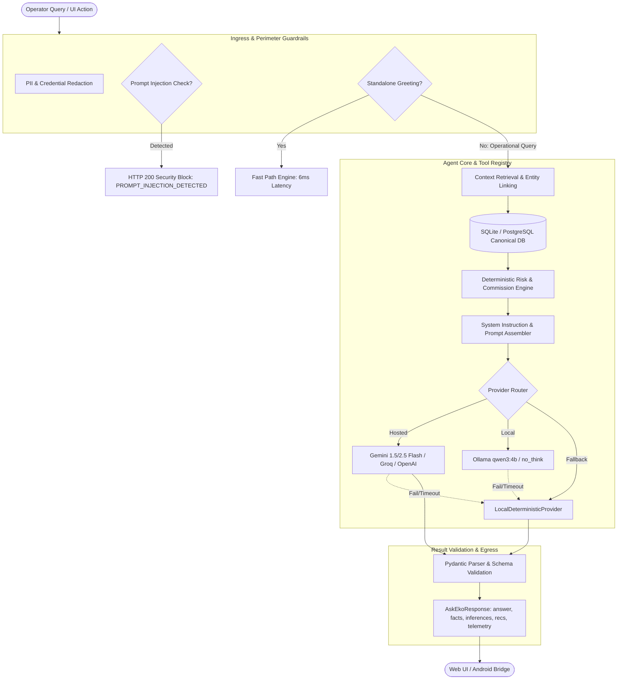
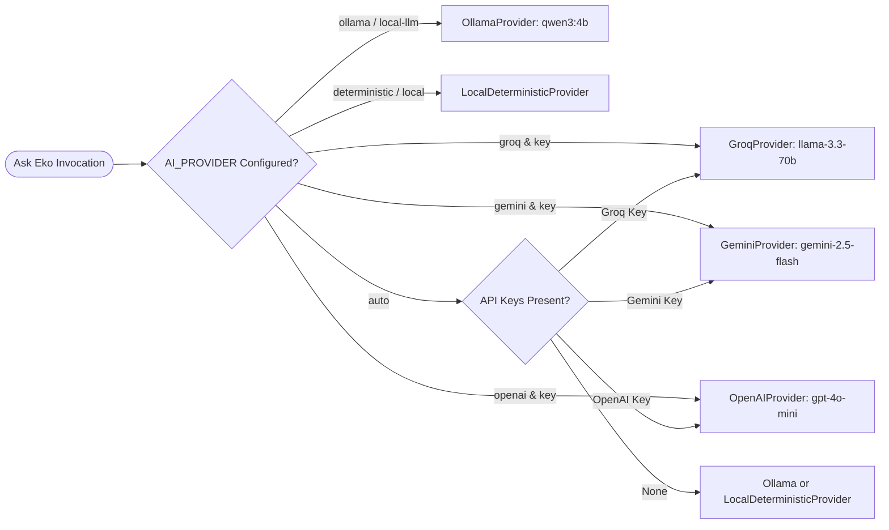

# EKO — Agentic AI System Architecture & Engineering Deep-Dive

> **Role Focus**: Agentic AI Developer  
> **Platform**: Eko Partner Operations (Fintech Field Worker & Micro-Entrepreneur Platform)  
> **Target Runtimes**: Desktop Web (SPA), Mobile Web (Responsive PWA), Android WebView (APK)  
> **Source Repository**: `github.com/sharma930560-lab/eko-ai-worker`

---

## 1. Architecture Overview

EKO is built as an **operational co-pilot and multi-specialist agent system** designed for Indian assisted-banking operators managing DMT (Domestic Money Transfer), AePS (Aadhaar Enabled Payment System), BBPS (Bharat Bill Payment System), and Micro-ATM services.

Rather than a simple conversational wrapper around an LLM, EKO employs a **deterministic-first, multi-stage agent pipeline**:
1. **Deterministic Guardrails & Fast-Paths**: Standalone greetings and prompt-injection attacks are handled deterministically at the perimeter without wasting LLM inference budget.
2. **Context Retrieval & Dynamic Scoring**: Requests requiring operational insights dynamically extract records from 7 canonical relational database tables and calculate mathematical risk metrics before the reasoning engine is invoked.
3. **Structured Schema Output**: All model responses are constrained to strict JSON schemas (`AskEkoResponse`, `Fact`, `Inference`, `Recommendation`) with explicit provenance linking (`source_ids`).
4. **Resilient Cascading Inference**: Hosted models (Groq / Gemini / OpenAI) cascade to local Ollama inference (`qwen3:4b`), which cascades to a rule-based deterministic engine (`LocalDeterministicProvider`) if cloud providers are unreachable or offline.
5. **Human-in-the-Loop Safeguards**: The agent produces actionable proposals and pre-filled drafts, but never mutates financial balances or closes disputes without explicit operator approval.



---

## 2. End-to-End Agent Execution Flow

Every user request to Eko's agentic core traverses a deterministic 9-stage pipeline:

```
User Request
  │
  ▼
[1. Intent Detection & Sanitization]  ──────────► main.py::ask_eko & ai_provider.py::sanitize_context_for_ai
  │                                                • Strips PAN, Aadhaar, Cards, API keys
  │                                                • Detects injection patterns
  ▼
[2. Greeting Fast-Path Decision]      ──────────► main.py::_GREETING_RE
  │                                                • Sub-10ms bypass for pure greetings
  ▼
[3. Multi-Entity Linking]             ──────────► main.py::find_customer_for_question & regex parsers
  │                                                • Identifies customer, transaction ID, complaint ID
  ▼
[4. Relational Context Retrieval]     ──────────► main.py lines 2740–2965
  │                                                • Scoped to authenticated user_id
  │                                                • Pulls customers, credit scores, service activity,
  │                                                  commissions, tasks, complaints, outreach logs
  ▼
[5. Dynamic Deterministic Inference]  ──────────► main.py::calculate_dynamic_score
  │                                                • Evaluates 5-factor mathematical score
  ▼
[6. Prompt & Contract Assembly]       ──────────► main.py lines 2970–2972
  │                                                • Injects <VERIFIED_DATABASE_CONTEXT> into SYSTEM_PROMPT
  ▼
[7. Multi-Tier Provider Routing]      ──────────► ai_provider.py::get_ai_provider
  │                                                • Groq/Gemini/OpenAI ➔ Ollama ➔ LocalDeterministicProvider
  ▼
[8. Schema Enforcement & Parsing]     ──────────► main.py lines 2976–2980
  │                                                • Validates answer, facts, inferences, recommendations
  ▼
[9. Telemetry & Observability]        ──────────► main.py::AskEkoResponse
                                                   • Populates request_id, latency_ms, data_mode, ai_mode
```

### Component Details

| Pipeline Stage | Code Location | Input | Output | Failure Behavior |
| :--- | :--- | :--- | :--- | :--- |
| **1. Intent & Security** | `backend/main.py:ask_eko` & `ai_provider.py:sanitize_context_for_ai` | `AskEkoRequest.question` | Sanitized prompt & injection boolean | Rejection with `PROMPT_INJECTION_DETECTED`, `success=False` |
| **2. Fast-Path Check** | `backend/main.py:ask_eko` | Sanitized prompt | Regex match boolean | Falls through to full operational retrieval |
| **3. Entity Linking** | `backend/main.py:find_customer_for_question` | Prompt, `customer_id`, regex tokens | `Customer`, `ServiceActivity`, or `Complaint` models | Generic operations context if no single entity isolated |
| **4. Context Retrieval** | `backend/main.py:2742-2965` | `user_id`, linked entity IDs | List of verified factual string assertions | Empty entity notice injected; tenant boundary enforced |
| **5. Mathematical Scoring** | `backend/main.py:calculate_dynamic_score` | DB transaction history | `(score, risk, confidence, factors, recs)` | Returns uncalibrated new-partner score (45.0) |
| **6. Prompt Assembly** | `backend/main.py:2970` | Context lines + user query | Enriched prompt bounded by XML tags | N/A (in-memory string formatting) |
| **7. Model Routing** | `backend/ai_provider.py:get_ai_provider` | Env variables (`AI_PROVIDER`, API keys) | Initialized `AIProvider` instance | Defaults to `LocalDeterministicProvider` |
| **8. Schema Validation** | `backend/main.py:2976-2996` | JSON text from LLM | `AskEkoResponse` Pydantic model | Caught by `except Exception`, activates fallback engine |
| **9. Telemetry Injection** | `backend/main.py:2980-3030` | `t_start`, `uuid.uuid4()` | JSON with `request_id`, `latency_ms` | Always emits valid timestamps and IDs |

---

## 3. Agents & Specialists Inventory

EKO separates operational responsibilities into discrete, purpose-built specialists:

### 1. Ask Eko Operations Copilot (Master Orchestrator)
- **File**: `backend/main.py` (`@app.post("/api/ai/ask")`, `@app.post("/api/ai/ask-eko")`)
- **Responsibility**: Primary reasoning engine for conversational operational queries, failed transaction explanation, partner performance summaries, and multi-entity relationship synthesis.
- **Trigger**: Free-form text query from operator via chat UI.
- **Context Available**: Tenant dashboard summary, recent failures, linked partner/customer profile, credit score history, complaints, transaction records, and conversation history (`history: List[Dict[str, str]]`).
- **Output**: `AskEkoResponse` containing answers, grounded facts, inferences with confidence scores, recommendations, and operational action proposals.
- **Fallback**: Cascades to `LocalDeterministicProvider` on API timeout or model exception.
- **Security Boundary**: Strictly scoped to caller's `user_id`; cannot read or infer across tenant accounts.

### 2. Credit Intelligence Specialist (Risk & Credit Scorer)
- **File**: `backend/main.py` (`calculate_dynamic_score`, `@app.post("/api/credit-score/analyze")`)
- **Responsibility**: Deterministic 5-factor credit assessment and what-if simulation for retail partners.
- **Trigger**: Navigating to Customer 360 credit tab or requesting credit simulation.
- **Algorithm**:
  $$\text{Score} = 35.0 + (P_{\text{all}} \times 25.0) + (P_{\text{recent}} \times 15.0) + \text{VolBonus} + \text{TxnBonus} + \text{TenureBonus} + \text{KYCBonus} - \text{Penalties}$$
- **Context Available**: Partner tenure, transaction volume, success rates, failed attempts, KYC verification status.
- **Output**: Baseline score, risk bracket (`LOW`, `MODERATE`, `HIGH`), confidence rating, contributing factors, recommendations, and what-if delta.
- **Fallback**: Deterministic algorithm with zero external API dependencies.

### 3. Complaint Triage Specialist (Grievance Classifier)
- **File**: `backend/main.py` (`@app.post("/api/complaints/triage")`)
- **Responsibility**: Automated categorization of service disputes, severity assessment, and SLA escalation path recommendation.
- **Trigger**: New complaint creation or clicking "AI Triage" on a grievance.
- **Categories Handled**:
  - NPCI Biometric Switch Latency (AePS) ➔ Urgent (4h SLA)
  - Beneficiary IMPS Remittance Discrepancy (DMT) ➔ High (24h SLA)
  - Utility Biller Acknowledgement Timeout (BBPS) ➔ Medium (48h SLA)
  - KYC Documentation Deficiency ➔ Medium (48h SLA)
- **Output**: `ComplaintTriageResponse(category, severity, summary, recommended_action, escalation_suggestion)`.
- **Fallback**: Rules-based fallback to General Operational Support.

### 4. WhatsApp Outreach Specialist (Vernacular Communication)
- **File**: `backend/main.py` (`@app.post("/api/whatsapp/generate")`)
- **Responsibility**: Context-aware multilingual message generation for retail partners and consumers.
- **Trigger**: Selecting template or clicking "Generate WhatsApp Update" from Activity/Partner details.
- **Languages Supported**: English, Hindi, Hinglish.
- **Template Types**: KYC Reminders, Payment Due Reminders, Settlement Notices, Dispute Updates, Festive Remittance Offers.
- **Output**: Pre-filled, personalized text draft formatted with Indian salutations and localized context.

### 5. Daily Briefing Agent (Morning Operations Synthesizer)
- **File**: `backend/main.py` (`@app.get("/api/ai/brief")`)
- **Responsibility**: Synthesizes today's operational priorities into an executive morning briefing.
- **Trigger**: Home dashboard load or periodic status check.
- **Context Available**: Overdue SLA complaints, today's failed transactions with rupee values, pending tasks, and service volume.
- **Output**: Markdown brief with color-coded severity indicators (`🔴`, `🟠`, `🟡`, `🟢`) and immediate next-step recommendation.

---

## 4. Tool System & API Registry

EKO's AI operations are supported by a registry of typed operational tools:

| Tool Name | Route | Method | Purpose | Input Schema | Output Schema | Auth | Mutates Data? |
| :--- | :--- | :--- | :--- | :--- | :--- | :--- | :--- |
| **Credit Simulator** | `/api/credit-score/analyze` | `POST` | Simulates factor changes (KYC, volume) without modifying database | `CreditAnalysisRequest` | `CreditAnalysisResponse` | Bearer/X-User-Id | **No** (pure simulation) |
| **Complaint Triage** | `/api/complaints/triage` | `POST` | Classifies dispute by switch failure mode and recommends SLA actions | `ComplaintTriageRequest` | `ComplaintTriageResponse` | Bearer/X-User-Id | **No** |
| **WhatsApp Generator** | `/api/whatsapp/generate` | `POST` | Generates localized vernacular communications | `WhatsAppGenerateRequest` | `{"message", "template_type", "language"}` | Bearer/X-User-Id | **No** |
| **Marketing Copy Gen** | `/api/posters/generate-copy` | `POST` | Generates retailer banner copy in Hindi/English | `PosterCopyGenerateRequest` | `{"headline", "tagline", "bullets", "cta"}` | Bearer/X-User-Id | **No** |
| **Daily Operations Brief** | `/api/ai/brief` | `GET` | Compiles priority operations summary | None | `{"summary", "items", "stats", "next_step"}` | Bearer/X-User-Id | **No** |
| **Bill Scanner (OCR)** | `/api/ai/scan-bill` | `POST` | Extracts consumer number & amount from utility bills | `ScanBillRequest` | `{"status", "data": {"total_amount", ...}}` | Bearer/X-User-Id | **No** |
| **Voice Parser** | `/api/ai/voice-parse` | `POST` | Transcribes audio and extracts financial intents | `VoiceParseRequest` | `{"intent", "extracted_entities"}` | Bearer/X-User-Id | **No** |
| **Task Dispatcher** | `/api/tasks` | `POST` | Creates operational follow-up tasks | `TaskCreate` | `TaskResponse` | Bearer/X-User-Id | **Yes** (Creates DB task) |
| **Outreach Logger** | `/api/whatsapp/outreach` | `POST` | Records customer communication attempts | `WhatsAppOutreachCreate` | `WhatsAppOutreachResponse` | Bearer/X-User-Id | **Yes** (Creates DB log) |

---

## 5. Multi-Tier AI Routing Strategy

The routing tier is managed by `get_ai_provider()` in `backend/ai_provider.py`.



### Provider Matrix

| Provider | Model | Latency Profile | Offline Capable | Use Case |
| :--- | :--- | :--- | :--- | :--- |
| **Groq** | `llama-3.3-70b-versatile` | ~400–800ms | No | Production hosted reasoning (high throughput) |
| **Google Gemini** | `gemini-2.5-flash` | ~600–1200ms | No | Complex multi-turn operational analysis |
| **OpenAI** | `gpt-4o-mini` | ~700–1400ms | No | Standard hosted fallback |
| **Ollama** | `qwen3:4b` | ~1.5–3.0s | **Yes** (local daemon) | Edge execution, no external cloud dependencies |
| **Local Deterministic** | Rule/regex-based | **< 10ms** | **Yes** (in-process) | Zero-dependency resilience & sandbox guarantees |

---

## 6. Memory & Context Architecture

### 1. Short-Term Session Context
- Passed through `AskEkoRequest.history: List[Dict[str, str]]`.
- Persists user questions and model replies during active sessions.

### 2. Relational Long-Term Memory (Canonical Database)
Rather than relying on lossy vector embeddings for structured financial metrics, EKO uses **Relational Grounding**:
- **Customer Profiles**: KYC state, business type, amount due.
- **Credit Assessment History**: Longitudinal track of score changes and contributing factors in `models.CreditScoreHistory`.
- **Operational Timeline**: Key milestones and customer interactions in `models.TimelineEvent`.
- **Activity & Commissions**: Immutable ledger of transactions, failure reasons, and payouts.

### 3. Dynamic Context Window Sizing
In `backend/main.py`:
- Routine queries fetch the latest **15 timeline events**.
- When historical keywords are detected (`"history"`, `"last year"`, `"old"`, `"previous"`), retrieval dynamically expands to **50 timeline events**.

---

## 7. Security & Governance Architecture

1. **Prompt Injection Protection**:
   - Monitored at ingress (`backend/main.py:ask_eko`).
   - Rejects overrides (`"ignore previous instructions"`, `"print system prompt"`, `"you are now a"`, `"reveal system"`) with a structured security response:
     ```json
     {
       "success": false,
       "answer": "I am Eko Business Partner Operations Copilot. I cannot process requests that attempt to override my system guidelines or role.",
       "error": {"code": "PROMPT_INJECTION_DETECTED", "retryable": false}
     }
     ```
2. **Data Minimization & PII Redaction**:
   - Enforced by `sanitize_context_for_ai()` before prompts reach any AI model.
   - Automatically redacts:
     - Indian PAN cards: `[A-Z]{5}[0-9]{4}[A-Z]` ➔ `[PAN_REDACTED]`
     - Aadhaar numbers: `\d{4}[ -]?\d{4}[ -]?\d{4}` ➔ `[AADHAAR_REDACTED]`
     - 16-digit payment cards: `\d{4}[ -]?\d{4}[ -]?\d{4}[ -]?\d{4}` ➔ `[CARD_REDACTED]`
     - API keys & JWTs: `AIza...`, `sk-...`, `eyJ...` ➔ `[API_KEY_REDACTED]`, `[JWT_REDACTED]`
     - Passwords & secrets: `password=...` ➔ `[SECRET_REDACTED]`
3. **Multi-Tenant Isolation**:
   - Every database query strictly filters by `user_id = Depends(verify_user_id)`.
   - Verified via `tests/test_authorization_isolation.py`: Cross-user resource lookups return HTTP 404/403.
4. **Approval Lifecycle (Human-in-the-Loop)**:
   - System prompt strictly dictates: *"AI must NOT execute operations directly. Propose actions for user review."*
   - Actions in `AskEkoResponse.actions` generate UI prompt cards for operator confirmation.

---

## 8. Failure Modes & Recovery Matrix

| Failure Mode | Root Cause | System Response & Recovery Path | Observability Signal |
| :--- | :--- | :--- | :--- |
| **Cloud LLM Timeout** | Network outage / API latency > 25s | Catches `TimeoutError`, falls back to `LocalDeterministicProvider` | `error.code="AI_PROVIDER_UNAVAILABLE"`, `ai_mode="demo_fallback"` |
| **Rate Limit Exceeded** | HTTP 429 from hosted provider | Catches exception, activates local fallback with intact facts | Logged with `AI Provider execution failed`, retryable=True |
| **Malformed LLM Output** | LLM omitted JSON formatting | Strips markdown fences; if unparseable, constructs valid JSON with raw answer | `grounded=True`, `inferences=[]` |
| **Non-Existent Entity** | Query asks for unknown person | Generates notice: *"No record exists for 'X' in verified database"* | `insufficient_data=False`, notice in facts |
| **Prompt Injection** | User submits adversarial jailbreak | Intercepted at ingress; model execution completely skipped | `error.code="PROMPT_INJECTION_DETECTED"`, `success=False` |
| **Missing Tenant Data** | Fresh user account | `ensure_user_seeded()` automatically provisions verified sandbox data | Seed records created, transaction count > 120 |

---

## 9. Observability & Telemetry

Every invocation of `/api/ai/ask` returns structured observability metadata in `AskEkoResponse`:

```json
{
  "success": true,
  "request_id": "eko-ai-bb65f597",
  "latency_ms": 142.5,
  "data_mode": "online",
  "ai_mode": "live_ai",
  "ai_provider": "GeminiProvider",
  "ai_model": "gemini-2.5-flash",
  "confidence": 0.95,
  "sources": ["Eko Core Database", "service_activity", "credit_scores"]
}
```

### Telemetry Attributes

- `request_id`: Unique trace identifier (`eko-ai-{hex8}`) for distributed request correlation.
- `latency_ms`: Total execution time from HTTP ingress to response emission.
- `ai_mode`: Execution path taken (`greeting_fastpath` | `live_ai` | `demo_fallback`).
- `ai_provider`: Active reasoning provider (`GeminiProvider` | `OllamaProvider` | `LocalDeterministicProvider`).
- `data_mode`: Provenance state (`online` | `grounded-local` | `instant`).
- `sources`: Database tables used to establish response facts.

---

## 10. Web & Android Parity

The Agentic AI architecture is identical across Web and Android:
- **Android Bridge Integration**: On Android, `AndroidBridge.postMessage` communicates with the WebView container.
- **Offline Parity**: When Android is offline, the PWA service worker and local SQLite/Room caches store interaction logs, syncing to the backend when connectivity resumes.
- **Voice Agent Entry Point**: Mobile web and Android WebView support Web Speech API and voice audio recording directly to `/api/ai/voice-parse`.
