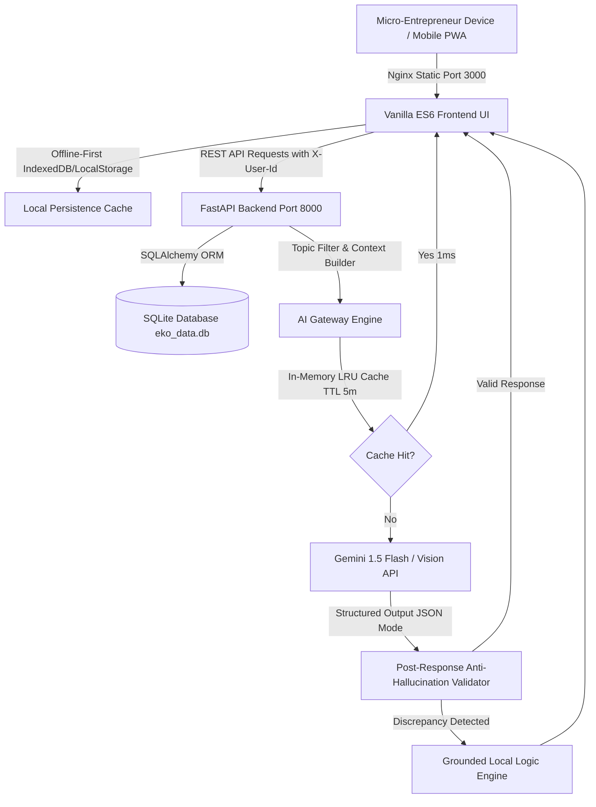

# Eko Micro-Entrepreneur AI Worker

> **A Device-Constrained, Production-Grade AI Operating System for Indian Small Businesses & Field Agents**

[](https://fastapi.tiangolo.com)
[](https://ai.google.dev)
[](https://developer.mozilla.org)
[](#privacy--data-protection)
[](https://docker.com)

---

## 🎯 Eko Mission Alignment

In semi-urban, rural, and deep rural markets across India, micro-entrepreneurs (kirana store owners, mobile recharge agents, ration distributors, local facilitators) represent the financial backbone of local commerce. 

Traditional software fails them because:
1. **Low digital comfort**: Store owners do not type on desktop keyboards or fill 10-field forms.
2. **Device constraints**: They operate on $70–$150 Android phones with intermittent 2G/3G/4G connectivity.
3. **Complex credit/khata chaos**: Transactions happen via messy handwritten parchii, Hindi voice notes, and informal WhatsApp promises.

**Eko Micro-Entrepreneur Worker** solves these exact problems by pairing lightweight, zero-dependency frontend architecture with **True Multimodal & Generative AI superpowers**.

---

## ⚡ 5 True Generative & Multimodal AI Superpowers

```
┌─────────────────────────────────────────────────────────────────────────────────────────────────┐
│                                   EKO AI SUPERPOWERS SUITE                                      │
├────────────────────────────────┬────────────────────────────────┬──────────────────────────────┤
│ 📷 Multimodal Bill Scanner     │ 🎙️ Vernacular Voice Khata      │ 💬 WhatsApp Studio & Debt    │
│ Gemini 1.5 Flash Vision reads  │ Web Speech API + Gemini NLP    │ Culturally nuanced tone-     │
│ messy handwritten Hindi/Eng    │ transforms unstructured Hindi  │ tuned messages (gentle,      │
│ parchment, receipts, and line  │ voice into structured ledger   │ firm overdue, festive combo) │
│ items with 1-click ledger save.│ items & follow-up reminders.   │ with direct 1-tap WhatsApp.  │
├────────────────────────────────┴────────────────────────────────┴──────────────────────────────┤
│ 🛡️ Khata Credit Risk & Trust Underwriting Scorer                                               │
│ Evaluates customer payment punctuality, delay days, and ticket volatility to generate a        │
│ Trust Score (1-100), safe credit limits, and delinquency warnings for micro-lending.          │
├─────────────────────────────────────────────────────────────────────────────────────────────────┤
│ 🎨 Generative Marketing Flyer & Status Creator                                                  │
│ Automatically crafts high-converting WhatsApp Status promo copy and renders a downloadable     │
│ HTML5 Canvas poster for instant local customer broadcast.                                      │
└─────────────────────────────────────────────────────────────────────────────────────────────────┘
```

---

## 🏗️ System Architecture



---

## 🛡️ Production AI Guardrails & Performance Optimization

| Feature | Implementation | Business Value |
|---|---|---|
| **Structured Output** | `response_mime_type="application/json"` | Guarantees reliable JSON rendering without client regex crashes. |
| **Selective Context Injection** | `classify_topic(question)` | Injects only relevant customer or task records (capped at 5) to minimize token consumption. |
| **Response Caching** | LRU hash cache (TTL = 300s) | Serves repeated queries in **~1ms** with zero redundant LLM API costs. |
| **Latency & Cost Caps** | `max_output_tokens=300`, `timeout=8.0s` | Strict timeouts avoid hanging UI on low-end 3G field connections. |
| **Anti-Hallucination** | System prompt contract + `validate_no_hallucinated_names()` | Rejects phantom customer names not present in the database. |
| **Transient Retries** | Exponential backoff (1s, 2s) | Resilient to transient Google API rate spikes and network drops. |
| **Metric Tracking** | `POST /api/ai/action-taken` | Logs recommendation conversion rates for product analytics. |

---

## 🔒 Privacy & Data Protection (DPDP Act 2023 Ready)

- **User Data Isolation**: Every customer, note, task, and AI query is strictly scoped to the authenticated `user_id`.
- **Zero Token Leakage**: OAuth tokens and credentials never touch client storage; backend uses Google token verification.
- **Client-Side Storage**: In Demo / Offline mode, data stays completely local inside the browser sandbox.
- **Minimal Scopes**: Only requests `openid`, `email`, and `profile` during Google Sign-in.

---

## 🚀 Quick Start (Local Setup)

### Option 1: Docker Compose (Web & Backend)
```bash
git clone https://github.com/sharma930560-lab/eko-ai-worker.git
cd eko-ai-worker

# Run everything (FastAPI backend + Nginx frontend)
docker-compose up --build
```
- **Web App**: `http://localhost:3000`
- **FastAPI Docs**: `http://localhost:8000/docs`

---

### Option 2: Native Android App (APK Build)
```bash
cd android

# Build debug APK
./gradlew assembleDebug   # Windows: gradlew.bat assembleDebug

# Install on connected device or emulator
adb install app/build/outputs/apk/debug/app-debug.apk
```

---

### Option 3: Local Dev Setup (FastAPI + Static Web)

#### 1. Backend (FastAPI)
```bash
cd backend
python -m venv venv
source venv/bin/activate  # Windows: venv\Scripts\activate
pip install -r requirements.txt

# Configure environment
cp .env.example .env

# Start server
uvicorn main:app --host 0.0.0.0 --port 8000 --reload
```

#### 2. Frontend (Static Web Server)
```bash
cd frontend
python -m http.server 3000
```
Open `http://localhost:3000` in any modern browser.

---

## 📱 Android Hybrid Native Architecture

```
┌──────────────────────────────────────────────────────────────────────────┐
│                            ANDROID WRAPPER                               │
├──────────────────────────────────────────────────────────────────────────┤
│ 🔐 Credential Manager (Native Google Sign-In)                            │
│    - Passkey & Google ID Token retrieval with zero WebView redirections │
│                                                                          │
│ 🌐 AndroidX WebViewAssetLoader                                           │
│    - Loads local assets via http://appassets.androidplatform.net/        │
│    - Eliminates Chromium Active Mixed Content blocks                     │
│    - Cleartext traffic permitted for local 10.0.2.2 dev emulation        │
│                                                                          │
│ 🌉 JavaScript Bridge (AndroidBridge)                                     │
│    - Offline SQLite Room Queue (SyncRepository, SyncDao, AuditLogDao)   │
│    - Bi-directional token and user identity injection                   │
└──────────────────────────────────────────────────────────────────────────┘
```

---

## 🧪 Recruiter Evaluation Walkthrough

1. **Option A: Web Demo**: Open `http://localhost:3000` and click **"Try Demo Mode"** (instant 1-click evaluation).
2. **Option B: Native Android APK**: Launch the installed Android app, sign in with Google or explore Demo Mode.
3. **Test 1: 📷 Parchii Scanner**: Click **AI Tools** → **Parchii Scanner** → Click test receipt *"Ramesh Khata Parchii"*. Observe Vision AI extracting items and totals with 1-click save.
4. **Test 2: 🎙️ Voice Khata**: Click **Voice Khata** → Click test sample *"Sharma ji 10 packet atta le gaye..."* → Observe natural language entity extraction and auto-create task.
5. **Test 3: 💬 WhatsApp Studio**: Click **WhatsApp Studio** → Switch tone to *"⚡ Firm & Professional Recovery"* → Click *"Open in WhatsApp"*.
6. **Test 4: 🛡️ Credit Risk Scorer**: Click **Credit Scorer** → Adjust delay slider → Observe real-time Micro-Lending Trust Score (1-100) and recommended credit cap.
7. **Test 5: 🎨 Flyer Creator**: Click **Flyer Creator** → Modify offer text → Observe real-time HTML5 canvas render and download PNG.
8. **Test 6: 🤖 Ask Eko Assistant**: Open **Ask Eko AI** → Click *"Daily plan summary"* → Click the **"Add to Tasks"** action button on the structured response card.

---

## 📜 License
Built with ❤️ by Paras Sharma for Eko Micro-Entrepreneur Operations. Open Source MIT License.

